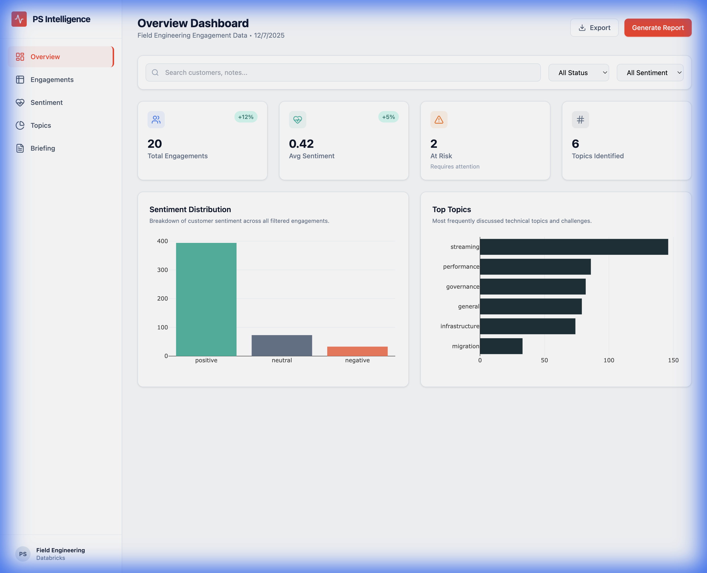
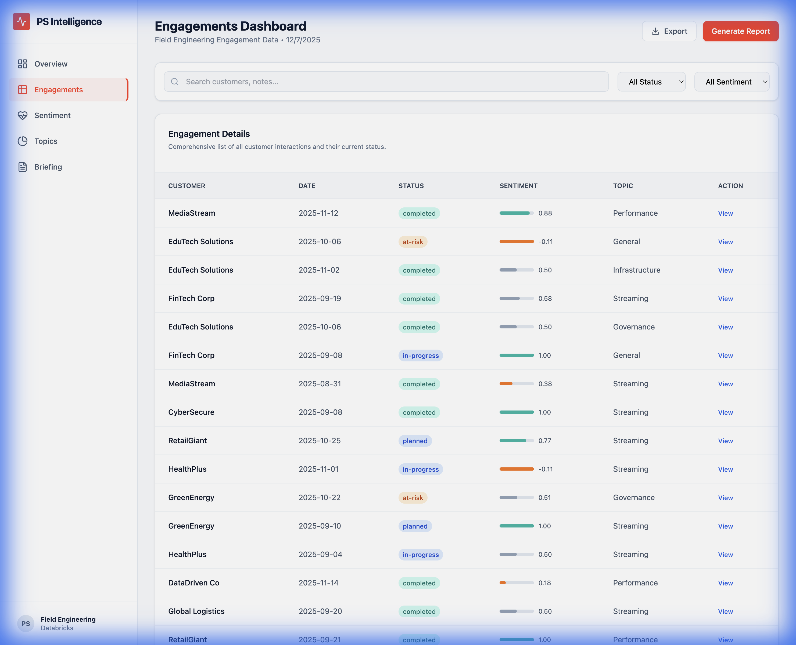
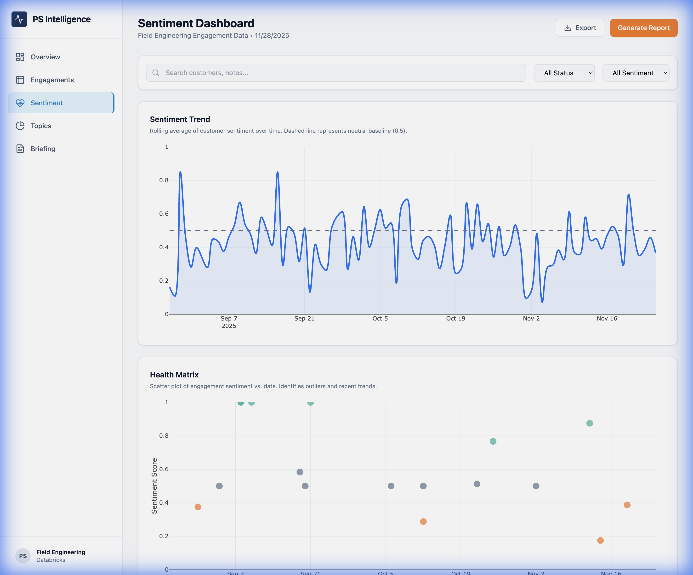
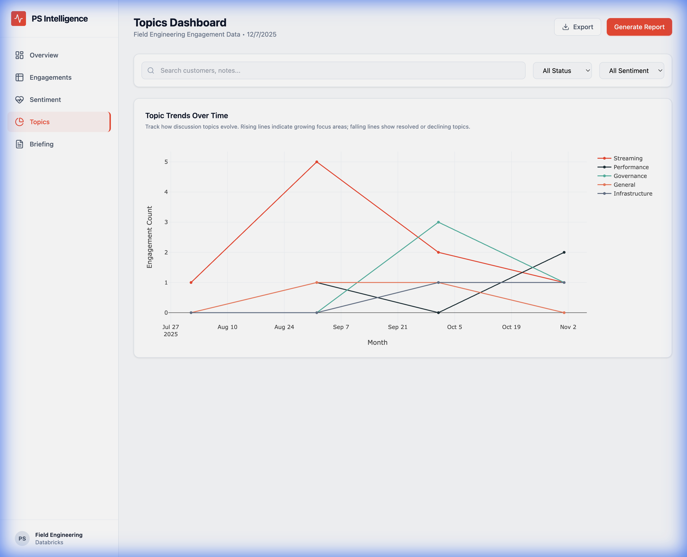
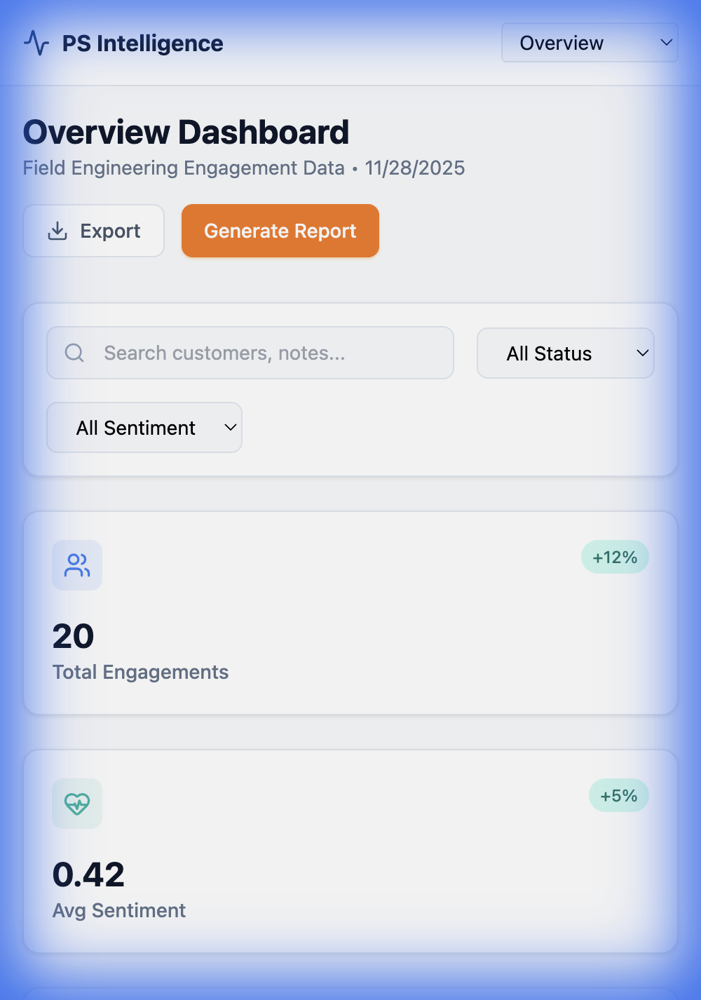

# Databricks PS Intelligence Dashboard

A modern, enterprise-grade data visualization platform for analyzing Databricks Professional Services engagements. This dashboard provides real-time insights into customer sentiment, engagement risks, and trending technical topics using a React + Plotly frontend and a FastAPI backend.



## 🚀 Overview

The **Databricks PS Intelligence Dashboard** is designed to help Field Engineering teams proactively manage customer engagements. It aggregates data from engagement logs, applies AI-driven sentiment analysis and topic extraction, and presents actionable insights through an interactive, professional interface.

### Key Features
- **Real-time KPI Tracking**: Monitor Total Engagements, Average Sentiment, At-Risk Accounts, and Topic Trends.
- **Interactive Visualizations**: Drill down into data with dynamic charts (Bar, Line, Scatter, Treemap).
- **Advanced Filtering**: Client-side filtering by Search, Status (At-Risk, Completed), and Sentiment.
- **Responsive Design**: Fully functional on desktop, tablet, and mobile devices.
- **Accessibility**: Color-blind friendly palette (Teal/Orange) and clear chart explanations.

---

## 📸 Dashboard Views

### 1. Executive Overview
The landing page provides a high-level summary of the business.
- **Sentiment Distribution**: Quickly see the ratio of Positive vs. Negative engagements.
- **Top Topics**: Identify the most discussed technical areas (e.g., "Streaming", "Unity Catalog").


*Figure 1: The Overview tab showing KPIs and high-level charts.*

### 2. Engagement Details
A detailed, sortable data grid for deep dives into specific customer interactions.
- **Status Badges**: Color-coded indicators for quick status checks.
- **Sentiment Bars**: Visual representation of sentiment scores (0.0 to 1.0).


*Figure 2: The Engagements tab with a detailed, filterable data table.*

### 3. Sentiment Analysis
Advanced analytics to track customer health over time.
- **Sentiment Trend**: A spline-interpolated line chart showing the rolling average sentiment.
- **Health Matrix**: A scatter plot (Sentiment vs. Date) to spot outliers and recent trends.


*Figure 3: The Sentiment tab featuring trend lines and a health matrix scatter plot.*

### 4. Topic Landscape
A hierarchical view of what's top-of-mind for customers.
- **Treemap**: Visualizes topic frequency, with larger blocks representing more common topics.


*Figure 4: The Topics tab displaying a Treemap of technical discussions.*

### 5. Mobile Experience
The dashboard is fully responsive, ensuring Field Engineers can access insights on the go.


*Figure 5: The dashboard adapts seamlessly to mobile screens with a collapsible sidebar.*

---

## 🛠️ Technology Stack

### Frontend
- **React 18**: Component-based UI architecture.
- **Plotly.js**: Enterprise-grade data visualization library.
- **Tailwind CSS**: Utility-first styling for a clean, modern look.
- **Lucide Icons**: Professional, consistent iconography.

### Backend
- **FastAPI**: High-performance Python web framework.
- **Pandas & NumPy**: Data manipulation and analysis.
- **Scikit-learn**: Machine learning utilities (clustering, etc.).
- **Hugging Face Transformers**: Local LLMs for sentiment and topic extraction.

### Data
- **JSON / Delta Lake**: Simulated engagement logs (extensible to real Delta Tables).

---

## 🚀 Quick Start

### Option 1: Standalone Dashboard (Recommended)
No Node.js required. Just run the backend and open the HTML file.

1. **Start Backend**
   ```bash
   python3 -m venv venv
   source venv/bin/activate
   pip install -r backend/requirements.txt
   cd backend && uvicorn app.main:app --reload --host 0.0.0.0 --port 8000
   ```

2. **Launch Dashboard**
   - Open `dashboard.html` in your browser.

### Option 2: Full React Development
For developers who want to customize the frontend code.

1. **Start Backend** (same as above)
2. **Start Frontend**
   ```bash
   cd frontend
   npm install
   npm run dev
   ```

---

## 🔮 Future Deployment Strategy

To move this from a local prototype to a production internal tool at Databricks:

1.  **Containerization**:
    - Build Docker images for Backend (`backend/Dockerfile`) and Frontend (`frontend/Dockerfile`).
    - Orchestrate with Kubernetes (EKS/AKS) or Databricks Apps.

2.  **Data Integration**:
    - Replace the JSON sample data with a direct connection to **Databricks SQL**.
    - Use the Databricks SDK to fetch real-time engagement logs from Delta Tables.

## 🧱 Databricks Integration Setup
This project supports direct integration with Databricks SQL Warehouses.

### One-Time Data Setup
1. **Import Notebook**: `notebooks/ingest_engagements.py` to your workspace.
2. **Run Once**: Run the notebook **one time** to create the `engagements` Delta table. parameters:
   - *Note: The data persists in Delta Lake, so you do NOT need to re-run this for every dashboard session.*
3. **Configure Backend**: Add your SQL Warehouse HTTP Path to `.env`.

3.  **Authentication**:
    - Integrate **SSO (Single Sign-On)** using Databricks OAuth or Okta to secure access.

4.  **CI/CD**:
    - Set up GitHub Actions pipelines to run tests (`pytest`) and build/push Docker images on every commit.
