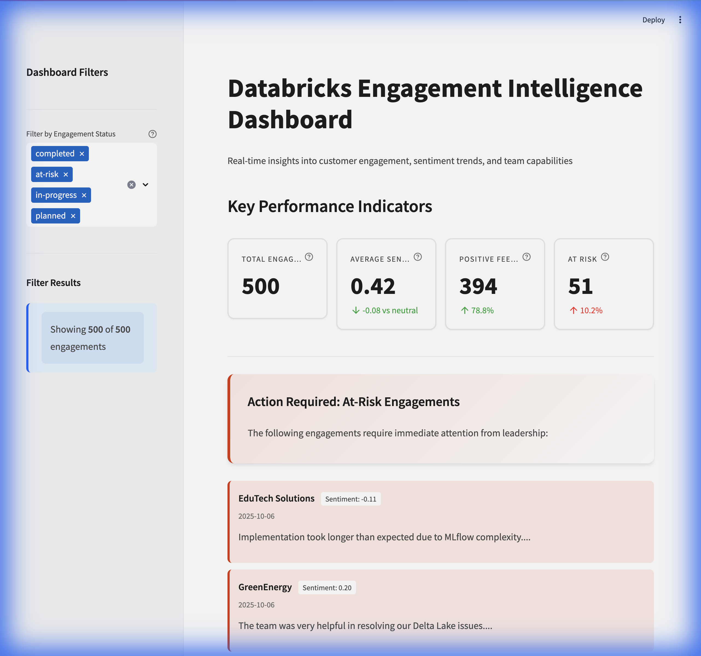
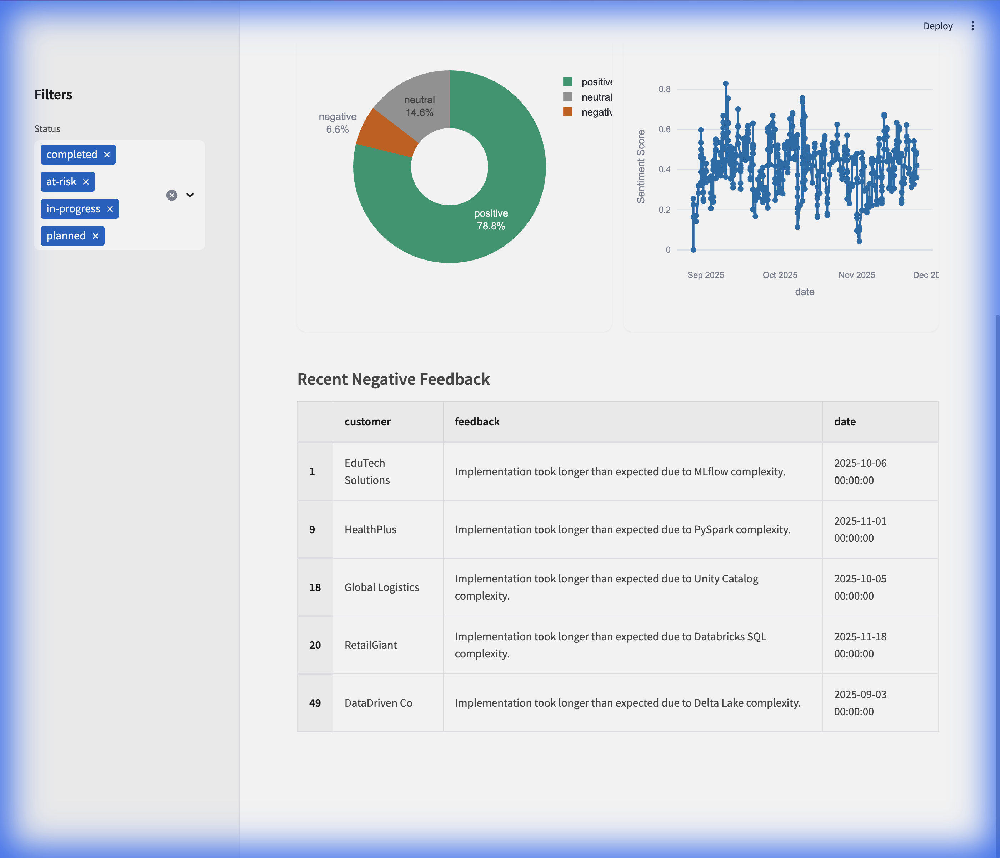
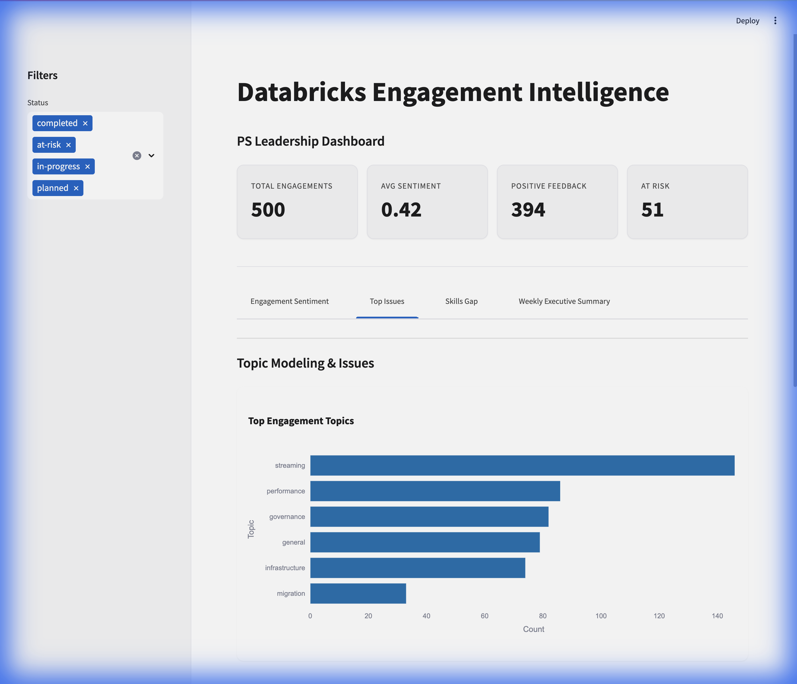
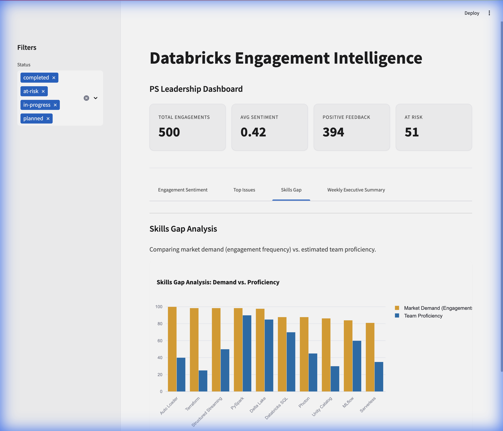
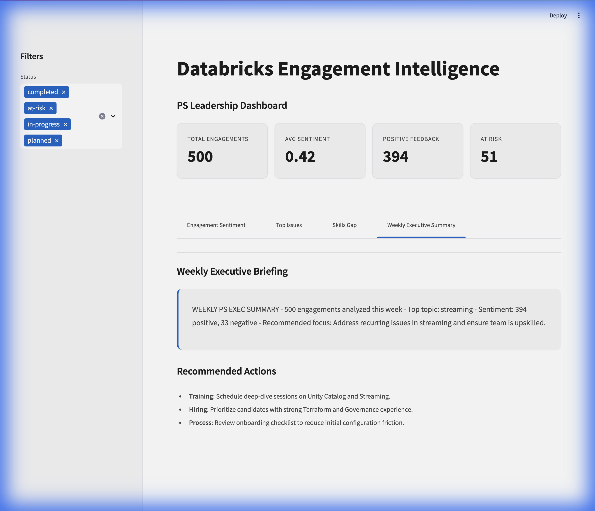

# Databricks Engagement Intelligence Dashboard

A realistic internal PS (Professional Services) analytics tool for Databricks leadership. This project simulates an AI-powered pipeline that ingests unstructured engagement data (notes, feedback) and produces strategic insights.

## Problem
Databricks PS teams generate large volumes of unstructured data. Leadership needs to know:
- What problems customers are facing most frequently?
- Which solutions work well?
- Which skills are missing on the team?
- Which engagements may be at risk?

## Solution
An AI + Databricks analytics pipeline that ingests sample engagement data and produces:
1.  **Sentiment Analysis**: Score customer feedback and notes.
2.  **Topic Modeling**: Identify themes like "Streaming", "Governance", etc.
3.  **Skills Gap Analysis**: Compare tech frequency vs. team proficiency.
4.  **Weekly Executive Summary**: LLM-generated strategic memo.
5.  **Dashboard**: A clean Streamlit interface to visualize outcomes.

## Visual Tour

### Main Dashboard

*Overview showing key metrics: Total Engagements, Average Sentiment, Positive Feedback, and At-Risk engagements.*

### Sentiment Analysis

*Pie chart showing sentiment distribution and trend line tracking sentiment over time, with a table of recent negative feedback.*

### Top Issues

*Bar chart displaying the most frequent engagement topics, with detailed notes filterable by topic.*

### Skills Gap Analysis

*Comparison between market demand (engagement frequency) and team proficiency across technologies.*

### Executive Summary

*AI-generated weekly briefing with key insights and recommended leadership actions.*

## Architecture
```mermaid
graph LR
    A[Raw Data (JSON)] --> B[Analysis Pipeline];
    B --> C{AI Models};
    C -->|Sentiment| D[Enriched Data];
    C -->|Topic Extraction| D;
    C -->|Summarization| E[Executive Summary];
    D --> F[Delta Lake / Processed JSON];
    F --> G[Streamlit Dashboard];
    E --> G;
```

## Tech Stack
-   **Python 3.11+**
-   **Streamlit**: Interactive dashboard
-   **Plotly**: Data visualization
-   **TextBlob**: Sentiment analysis
-   **Pandas**: Data manipulation
-   **Databricks SDK**: (Optional) For Delta Lake integration

## Setup & Usage

1.  **Create Virtual Environment**
    ```bash
    python3 -m venv venv
    source venv/bin/activate
    pip install -r requirements.txt
    ```

2.  **Generate Synthetic Data**
    ```bash
    python -m app.utils.data_generator
    ```

3.  **Run Analysis Pipeline**
    ```bash
    python -m app.main_pipeline
    ```

4.  **Launch Dashboard**
    ```bash
    streamlit run app/dashboard/streamlit_dashboard.py
    ```

## Project Structure
-   `app/utils/data_generator.py`: Generates realistic synthetic engagement records.
-   `app/main_pipeline.py`: Orchestrates the data loading and analysis.
-   `app/llm/`: Contains modules for sentiment, topic extraction, and summarization.
-   `app/dashboard/`: Contains the Streamlit app and plot components.
-   `data/`: Stores raw and processed JSON data.

## Demo Walkthrough
1.  **Data Generation**: Creates 500 records with varying industries, technologies, and statuses.
2.  **Analysis**: The pipeline processes text to extract sentiment and topics, and generates a weekly summary.
3.  **Dashboard**:
    -   **Engagement Sentiment**: View sentiment distribution and trends.
    -   **Top Issues**: Identify recurring technical challenges.
    -   **Skills Gap**: Visualize demand vs. team proficiency.
    -   **Executive Summary**: Read the AI-generated weekly briefing.

## Features

### Modern, Accessible Design
- **WCAG AA Compliant**: All colors meet accessibility standards with verified contrast ratios
- **Responsive Layout**: Fully responsive design that works on desktop, tablet, and mobile
- **Color-blind Friendly**: Uses carefully selected color palettes safe for all users
- **Professional UI**: Clean, modern interface with smooth animations and hover effects

### AI-Powered Insights
- **Sentiment Analysis**: Automatically scores customer feedback using TextBlob
- **Topic Extraction**: Identifies recurring themes and technical challenges
- **Executive Summaries**: Generates strategic insights for leadership

### Interactive Visualizations
- **Dynamic Charts**: Interactive Plotly charts with responsive containers
- **Filterable Data**: Sidebar controls to filter by engagement status
- **Real-time Updates**: Dashboard responds instantly to filter changes
